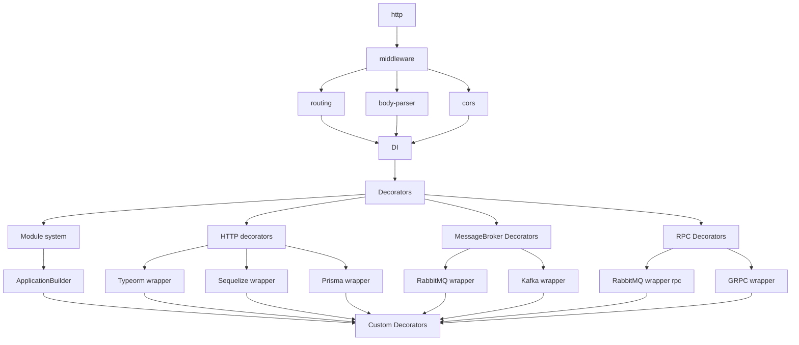

```mermaid
graph TD;
A[http] --> B[middleware]
B --> C[routing]
B --> D[body-parser]
B --> E[cors]
C --> F[DI]
D --> F[DI]
E --> F[DI]
F --> N[Decorators]
N --> O[Module system]
O --> S[ApplicationBuilder]
N --> G[HTTP decorators]
G --> H[Typeorm wrapper]
G --> I[Sequelize wrapper]
G --> J[Prisma wrapper]
N --> K[MessageBroker Decorators]
K --> L[RabbitMQ wrapper]
K --> M[Kafka wrapper]
N --> P[RPC Decorators]
P --> Q[RabbitMQ wrapper rpc]
P --> R[GRPC wrapper]
S --> T[Custom Decorators]
H --> T[Custom Decorators]
I --> T[Custom Decorators]
J --> T[Custom Decorators]

L --> T[Custom Decorators]
M --> T[Custom Decorators]
Q --> T[Custom Decorators]
R --> T[Custom Decorators]
```